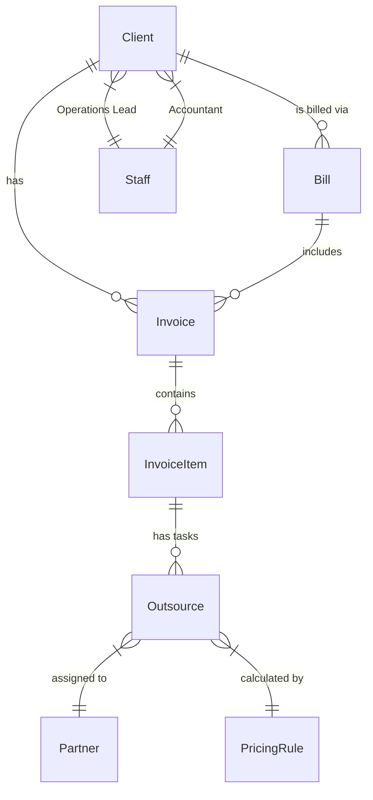

# データベース設計 (Database Schema)

Video Invoice Systemのデータモデル仕様書です。
ORMとして **Prisma (SQLite)** を使用しています。

## ER図 (概略)

## 主要モデル定義

### 1. 案件管理 (Invoice / Project)

実際には「請求書」ではなく「案件(Job)」を表します。

| Field | Type | Description |
| :--- | :--- | :--- |
| `id` | UUID | 案件ID |
| `clientId` | FK | 紐づくクライアント |
| `staffId` | FK | 担当PM (Operations) |
| `status` | String | `DRAFT`, `受注前`, `進行中`, `納品済`, `請求書作成済`, `送付済`, `完了`, `失注` |
| `items` | Relation | 案件の内訳（品目） |
| `billId` | FK | 紐づく月次請求書 (Nullable: まだ請求されていない場合はNull) |
| `totalAmount` | Float | 案件の合計請求額 (税込) |
| `profit` | Float | 粗利 |
| `issueDate` | Date | 案件としての発生日 (≠請求日) |
| `actualDeliveryDate` | Date | 納品完了日 |

### 2. 品目 & タスク (InvoiceItem & Outsource)

案件は階層構造を持ちます: `Invoice` > `InvoiceItem` > `Outsource`

#### InvoiceItem (品目)
クライアントへの提示単位（例: "PR動画制作"）。

| Field | Type | Description |
| :--- | :--- | :--- |
| `name` | String | 品目名 |
| `amount` | Float | 品目の小計金額 |
| `outsources` | Relation | この品目を構成する作業タスク |

#### Outsource (タスク / 担当領域)
実際の作業単位（例: "撮影", "編集"）。ここで原価が発生します。

| Field | Type | Description |
| :--- | :--- | :--- |
| `pricingRuleId` | FK | 適用する料金ルール |
| `partnerId` | FK | 担当パートナー（外注先） |
| `revenueAmount` | Float | このタスクの売上寄与額 |
| `costAmount` | Float | パートナーへの発注額 (原価) |
| `status` | String | タスク進捗 (`受注前`, `制作中`, `納品済`) |
| `deliveryDate` | Date | パートナー納期 |
| `duration` | String | 尺 (mm:ss) - 料金計算の基準 |

### 3. 月次請求 (Bill)

クライアントへ送付する正式な請求書。

| Field | Type | Description |
| :--- | :--- | :--- |
| `id` | UUID | 請求書ID |
| `clientId` | FK | クライアント |
| `invoices` | Relation | この請求書に含まれる案件群 |
| `totalAmount` | Float | 請求総額 |
| `issueDate` | Date | 発行日 |
| `paymentDueDate` | Date | 支払期限 |
| `status` | String | `ISSUED` (発行済), `PAID` (入金済) |

### 4. マスタデータ

- **Client**: 取引先企業。担当スタッフ(PM/経理)や、使用する料金ルール紐付けを持つ。
- **Partner**: 外注パートナー。役割（Role）や契約情報を持つ。
- **Staff**: 自社スタッフ。`User` (認証アカウント) と紐づく。
- **PricingRule**: 単価表。尺(Duration)に応じた「Fixed(固定)」「Linear(比例)」「Stepped(段階)」計算ロジックを持つ。

### 5. システム管理

- **StaffInvitation**: 招待リンク生成用モデル。
- **User / Account / Session**: NextAuth.js用認証モデル。
- **AuditLog**: 操作ログ（「誰が」「何を」「どうした」）。
